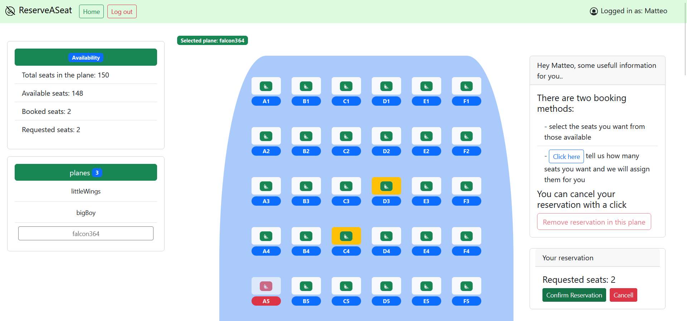

## React Client Application Routes

- Route `/`: pagina principale, mostra la lista degli aerei con tutte le loro informazioni. Viene mostrata all'arrivo sul sito.
- Route `/plane/:planeId`: pagina rappresentate la piantina bidiemensionale e la situazione interna dei posti per l'aereo con id "planeId"
- Route `/login`: pagina di login, contiene un form per l'accesso.
- Route  `*`: per le pagine che non esistono.

## API Server

- POST `/api/reservations` 
  - Descrizione: permette di inserire una nuova prenotazione. La prenotazione andra' a buon fine solamente se l'utente che la richiede non ha gia' un'altra prenotazione attiva sull'aereo in cui si intende prenotare. L'utente che aggiunge la prenotazione è preso dalla sessione. 
  - Autenticata
  - Request body: Un oggetto rappresentante la prenotazione di un set di posti per un determinato aereo (Content-Type: `application/json`).
  ```
  {
    "seats": [
      {"row":3,"seat":2},
      {"row":3,"seat":3}
    ],
    "planeId":1
  }
  ```
  - Response: 
    - Successo `201 Created`.
    - Errore database `503 Service Unavailable`.
    - Se il corpo della richiesta non è valido `422 Unprocessable Entity`.
    - Se l'aereo per cui si intende prenotare non esiste `404 Not Found`.
    - Se la richiesta proviene da un utente non autenticato `401 Unauthorized`.
    - Se l'utente che richiede la prenotazione ha gia' una prenotazione attiva per quell'aereo o se uno o piu' dei posti richiesti dall'utente sono stati occupati da un'altra prenotazione `400 bad request`.
    - Se vengono richiesti un numero di posti maggiore della capienza dell'aereo `406 Not Acceptable`
    - response body content: la lista degli id di ogni nuovo record inserito nella tabella prenotazioni o in caso di errore un oggetto con una proprieta' `error` descrivente l'errore. La risposta sara' in formato JSON (Content-Type: `application/json`).
  ```
  [ 16, 17]
  ```
  Esempio errore:
   ``` 
    {
      "error": "...it looks like you already have a reservation in this plane" 
    }
  ``` 
  - Nota: in caso di errore `400` a causa di conflitto durante la prenotazione, il body response sara' costituito da un oggetto avente come proprieta' error (descrivente l'errore) e una seconda proprieta' chiamata conflictSeats che non è altro che una lista di oggetti, ognuno descrivente un posto in conflitto tra quelli richiesti (nella prenotazione che ha fallito).
   ``` 
  {
    "error":"...one or more of the requested seats are not available.",
    "conflictSeats":
      [
        {"row":12,"seat":4},
        {"row":12,"seat":5}
      ]
  }
  ``` 
  

- GET `/api/planes/:id`
  - Descrizione: ricava le informazioni relative ad un aereo con un certo `id` 
  - Parametri nella richiesta: `id` dell'aereo
  - Request body: _None_
  - Response: `200 OK` (successo), `404 Not Found` (aereo non trovato), o `500 Internal Server Error` (errore generico).
  - Response body: un oggetto che contiene l'informazione sull'aereo e la lista delle prenotazioni ad esso associate, (Content-Type: `application/json`).
   ```
  {
    "id":2,
    "name":"bigBoy",
    "type":"regional",
    "f":20,"p":5,
    "booked":2,
    "reservations":
      [
        {"row":20,"seat":3,"userId":5},
        {"row":15,"seat":5,"userId":5}
      ]
  }
   ```

- GET `/api/planes` 
  - Descrizione: prende la lista di tutti gli aerei
  - Request body: _None_
  - Response:  `200 OK` (successo) or `500 Internal Server Error` (Errore generico).
  - Response body: un array di oggetti, ognuno contenente le informazioni sull'aereo tra cui il numero di prenotazioni attive per quell'aereo. (Content-Type: `application/json`).
  ```
  [{
    "id":1,
    "name":"littleWings",
    "type":"local",
    "f":15,
    "p":4,
    "booked":4
  },
  ...
  ]
  ```

- DELETE `/api/reservations/:planeId`
  - Descrizione: cancella la prenotazione dell'utente che richiede il servizio sull'aereo con id `planeId`. L'utente che richiede la cancellazione deve essre lo stesso della prenotazione che si intende cancellare, in altre parole: un utente non deve poter cancellare le prenotazioni di altri utenti.
  - Parametri nella richiesta: `id` dell'aereo
  - Autenticata
  - Request body: _None_
  - Response: `200 ok` (successo), `503 Service Unavailable` (errore generico), Se la richiesta proviene da un utente non autenticato, `401 Unauthorized`. Se non c'è nessuna prenotazione per l'utente che richiede il servizio sull'aereo specificato o se l'aereo specificato non esiste `404 Not Found`.
  - Response body: viene ritornato il numero di record cancellati dalla tabella `reservation` in caso di esito positivo , in caso di error `404` un oggetto:
   ```
  { "error":"Reservation not found."}
  ```
  (Content-Type: `application/json`).


- POST `/api/sessions` 
  - Descrizione: Crea una nuova sessione a partire dalle credenziali fornite
  - Request body:
  ```
  {
    "username":"u1@p.it",
    "password":"pwd"
  }
  ```
  - Response: `200 OK` (successo) or `401 Unauthorized User` (login fallito).
  - Response body:
  ```
  {
    "id":1,
    "username":"u1@p.it",
    "name": "Matteo"
  }
  ```

- DELETE `/api/sessions/current`
  - Descrizione: Per il logout , cancella la sessione corrente
  - Request body: _None_
  - Response: `200 OK` (successo)
  - Response body: _None_

- GET `/api/sessions/current` 
  - Descrizione: Verifica se la data sessione è ancora valida e ritorna l'info sull'utente loggato. 
  - Autenticata
  - Request body: _None_
  - Response: `200 ok` (successo) or `401 Unauthorized` (errore).
  - Response body: 
 ```
 {
  "id":1,
  "username":"u1@p.it",
  "name": "Matteo"
 }
 ```


## Database Tables

- Table `users` - struttura: (id, email, name, salt, password)
- Table `planes` - struttura: (id, name, type, F, P)
- Table `reservation` - struttura: (id, row, seat, userId, planeId) 

NOTA: nella tabella `planes` F indica il numero di file e P il numero di posti per fila.

## Main React Components

- `PlaneCard` (in `HomePage.jsx`): componente che racchiude tutte le informazioni di un aereo. In particolare la homepage contiene una lista di PlaneCard.
- `PlaneMap` (in `MainContents.jsx`): componente rappresentate la piantina bidimensionale dei posti dell'aereo con il loro stato. Se l'utente è loggato, mostrera' dei componenti per la realizzazione o cancellazione di una prenotazione.
- `PlaneSeatsForm` (in `PlaneSeatsForm.jsx`): questo componente contiene un form necessario all'utente oer immettere il numero dei posti da prenotare e il sistema li assegnerà per lui. Il form sara' visibile solo se l'utente è loggato e solo se l'utente non sta selezionando manualmente dei posti. 
- `MySideBar` (in `NavigationComponents.jsx`): quando si è sulla route del singolo aereo questa side bar presenta due sezioni. In quella  in alto sono visualizzate le informazioni relative alla situazione sui posti, in quella in basso si potra' cambiare aereo scegliendone uno tra quelli in lista.
- `LoginForm` (in `LoginForm.jsx`): componente contenente il form di loggin.


## Screenshot



## Users Credentials

* username: u1@p.it, password: "pwd"
* username: u2@p.it, password: "pwd"
* username: u3@p.it, password: "pwd"
* username: u4@p.it, password: "pwd"
* username: u5@p.it, password: "pwd"

## Additional Information

- L'email di un utente funge da username
- Lista degli utenti registrati (email e nome associato):
* email: u1@p.it, name: Matteo
* email: u2@p.it, name: Elisabetta
* email: u3@p.it, name: Luca
* email: u4@p.it, name: Filippo
* email: u5@p.it, name: Emily
- Nella tabella `reservation` ogni record corrisponde ad un posto su uno specifico aereo e prenotato per da uno specifico utente. 
- Due utenti (Matteo, Elisabetta) non hanno alcuna prenotazione attiva.
- Luca ha una prenotazione relativa a 4 posti sull'aereo di tipo `local`
- Filippo ha una prenotazione relativa a 2 posti sull'aereo di tipo `international`
- Emily ha una prenotazione relativa a 2 posti sull'aereo di tipo `regional`


